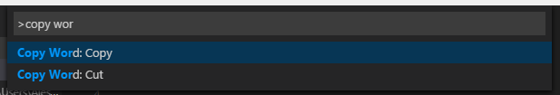

# Functionality

Replaces the default Copy/Cut commands, and uses the current word when no text is selected.

* `Ctrl-C` / `Cmd-C` - copy the current word
* `Ctrl-X` / `Cmd-X` - cut the current word

# Usage

### Availble commands



After installing the extension, 

### Using as your default shortcuts

You only need to update your **Keyboard Shortcuts**. 

Go to `File / Preferences / Keyboard Shortcuts` and add two new entries:

### Windows/Linux
```
    { "key": "Ctrl+c",          "command": "copy-word.copy" },
    { "key": "Ctrl+x",          "command": "copy-word.cut" }
```
### Mac
```
    { "key": "Cmd+c",          "command": "copy-word.copy" },
    { "key": "Cmd+x",          "command": "copy-word.cut" }
```

# License

[MIT](LICENSE.md) &copy; Alessandro Fragnani

---

[](https://www.paypal.com/cgi-bin/webscr?cmd=_donations&business=EP57F3B6FXKTU&lc=US&item_name=Alessandro%20Fragnani&item_number=vscode%20extensions&currency_code=USD&bn=PP%2dDonationsBF%3abtn_donate_SM%2egif%3aNonHosted) if you enjoy using this extension :-)